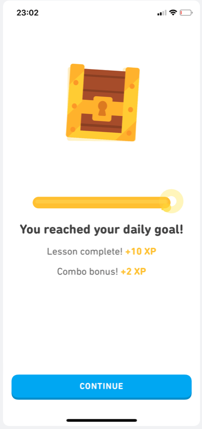
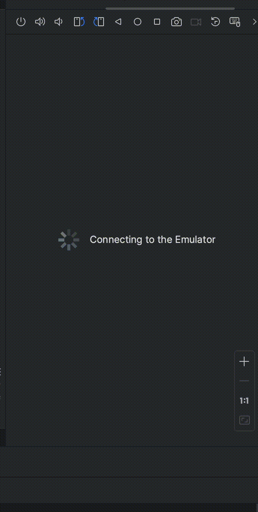

<!-- (This is a comment) INSTRUCTIONS: Go through this page and fill out any **bolded** entries with their correct values.-->

# AND101 Project 3 - Animals Doulingo Goal Page

Submitted by: **Mary Ramirez**

Time spent: **4** hours spent in total

## Summary

**Animals Doulingo Goal Page** is an android app  that **mimics the Duolingo goal page, enabling me to engage in practice sessions focusing on the following concepts:Crafting my own Android application layouts from the ground up, Employing ConstraintLayout, TextView, and ImageView components Customizing view attributes using XML attributes**

If I had to describe this project in three (3) emojis, they would be: **🤓📚⭐**

## Application Features

<!-- (This is a comment) Please be sure to change the [ ] to [x] for any features you completed.  If a feature is not checked [x], you might miss the points for that item! -->

The following REQUIRED features are completed:

- [X] Pick an app screenshot to duplicate
  - Be sure to add the screenshot to "Chosen Screenshot" below.
- [X] Create a runnable app that displays an Animal Version of your chosen screenshot
- [X] Layout uses one (1) or more ConstraintLayout
- [X] Layout uses one (1) or more ImageView
- [X] Layout uses three (3) or more TextViews

The following STRETCH features are implemented:

- [ ] Create a custom-shape Button using Shape Drawables
- [ ] Customize the text fonts by creating new Font Resources
- [ ] Add Tooltips to your Views to help users understand how to navigate the UI
- [ ] Create a second layout, this time for an original, personal app idea

The following EXTRA features are implemented:

- [ ] List anything else that you added to improve the app!

## Chosen Screenshot

I have chosen to duplicate the following layout from the **Doulingo Goal Page** app:

## Video Demo

Here's a video / GIF that demos all of the app's implemented features:

GIF created with **Kap**

<!-- Recommended tools:
- [Kap](https://getkap.co/) for macOS
- [ScreenToGif](https://www.screentogif.com/) for Windows
- [peek](https://github.com/phw/peek) for Linux. -->

## Original App Layout (Optional Stretch Feature)

Here is my entry for the "Create a second layout, this time for an original, personal app idea" stretch feature:

It is for an app that **mimics the Duolingo goal page, enabling me to engage in practice sessions focusing on the following concepts:Crafting my own Android application layouts from the ground up,Employing ConstraintLayout, TextView, and ImageView components Customizing view attributes using XML attributes**.

## Notes

Here's a place for any other notes on the app, it's creation process, or what you learned this unit!

## License

Copyright **2024** **Mary Ramirez**
